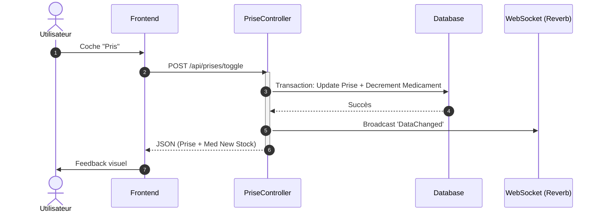
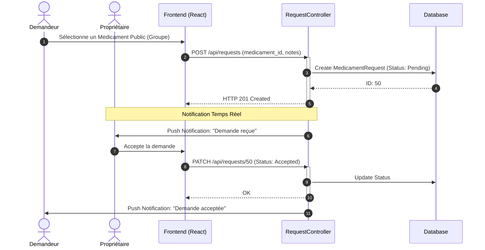
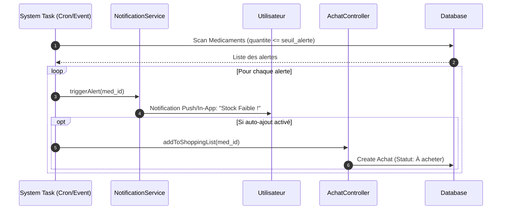

# Diagrammes de Séquence - HomeMed Manager (Processus Métiers)

Cette page documente les interactions dynamiques critiques entre les composants du système.

---

## 1. Suivi d'Observance (Toggle Prise)
*Ce flux montre comment une prise est enregistrée et comment le stock est décrémenté.*

---

## 2. Demande de Partage (Social Collaboration)
*Ce flux illustre la demande d'un médicament entre deux membres d'un groupe.*

---

## 3. Automatisation des Alertes & Logistique
*Ce flux montre comment le système réagit à un stock bas.*

## Synthèse technique
Ces diagrammes démontrent la robustesse des interactions :
- **Atomicité** dans la gestion des prises.
- **Réactivité** dans la collaboration sociale.
- **Proactivité** dans la gestion logistique.
