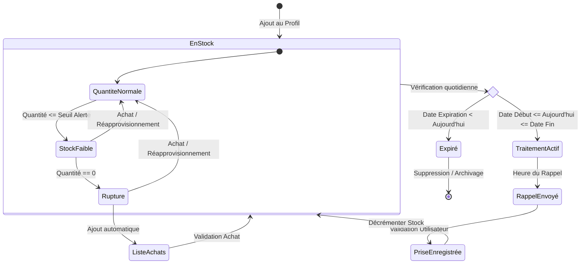

# Diagramme d'État - Cycle de Vie d'un Médicament

Ce diagramme illustre les différents états d'un médicament dans le système HomeMed Manager, de son ajout à son épuisement ou expiration.

## Description des États
1. **EnStock** : Le médicament est disponible dans l'armoire à pharmacie.
2. **StockFaible** : Le système déclenche une notification visuelle pour prévenir l'utilisateur.
3. **Rupture** : Le médicament est épuisé. Le système suggère de l'ajouter à la liste d'achats.
4. **Expiré** : Le médicament est périmé. Une alerte critique est affichée pour éviter tout risque de santé.
5. **TraitementActif** : L'utilisateur est actuellement sous traitement avec ce médicament (période définie).
